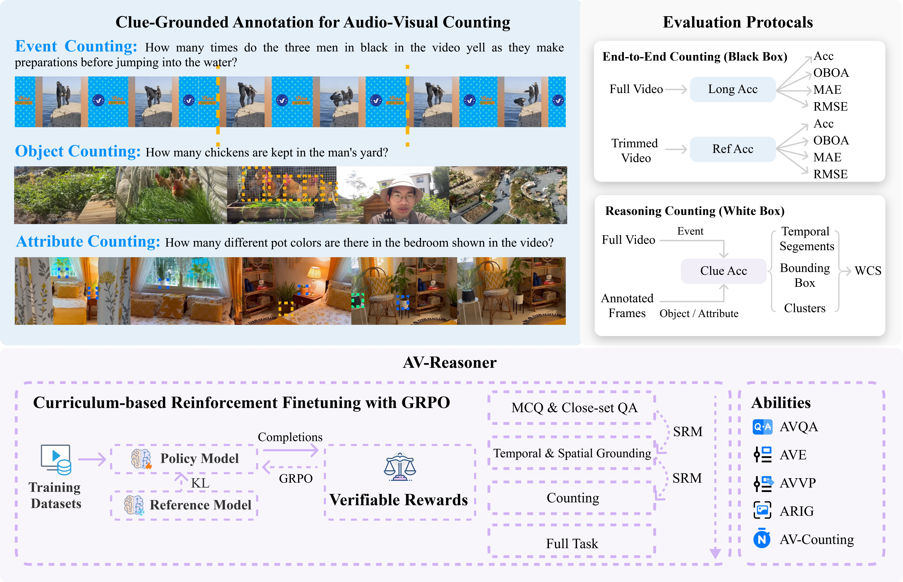

<h3 align="center">AV-Reasoner: Improving and Benchmarking Clue-Grounded Audio-Visual Counting for MLLMs</h3>
<p align="center">
    
<p>

<h5 align="center">

[](https://huggingface.co/lulidong/AV-Reasoner) [](https://huggingface.co/datasets/CG-Bench/CG-AV-Counting) [](https://arxiv.org/pdf/25xx.xxxxx) [](https://av-reasoner.github.io/) <br>

</h5>

## 🛠️ Requirements and Installation
### Training AV-Reasoner
To train **AV-Reasoner**, please follow these steps:

1. **Install Ola-Omni dependencies**  
   Follow the official guide here: [Ola](https://github.com/Ola-Omni/Ola)

2. **Install additional dependencies**  
   After setting up Ola-Omni, install the following dependencies to run the training script:

```plain
accelerate>=1.2.1
bitsandbytes>=0.43.0
einops>=0.8.0
datasets>=3.2.0
deepspeed==0.15.4
hf_transfer>=0.1.4
huggingface-hub[cli]>=0.19.2,<1.0
liger_kernel==0.5.2
packaging>=23.0
safetensors>=0.3.3
sentencepiece>=0.1.99
transformers
trl
torch>=2.5.1
pytest
parameterized>=0.9.0
black>=24.4.2
isort>=5.12.0
flake8>=6.0.0
math-verify
wandb>=0.19.1
pillow
```

### Evaluating CG-AV-Counting
If you only want to evaluate CG-AV-Counting, you just need to install the following dependencies:

```plain
numpy
scipy
scikit-learn
Pillow
requests
decord
```

## 🗝️ Training with GRPO
> [!NOTE] 
> We recommend training on at least 4 A100 (80GB) GPUs, otherwise you may encounter CUDA out-of-memory errors.

```
cd train
bash train.sh
```

## 🥰 Acknowledgement

- Our codebase is conducted on [Open-R1-Video](https://github.com/Wang-Xiaodong1899/Open-R1-Video) and [Ola](https://github.com/Ola-Omni/Ola)
